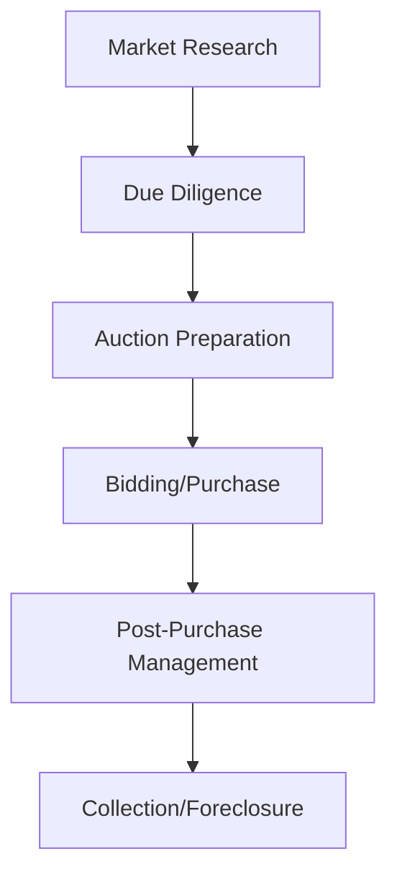

# Tax Lien Investing Overview

## Introduction to Tax Liens and Tax Deeds

Tax lien and tax deed investing are strategies that allow investors to purchase either:
- The right to collect unpaid property taxes (tax liens)
- The actual property through tax deed sales (tax deeds)

### Why Consider Tax Lien Investing?
- Potential for high interest returns (varies by state, typically 12-36%)
- Secured by real estate
- Lower capital requirements compared to traditional real estate investing
- Possibility of property acquisition below market value

### Key Differences: Tax Liens vs Tax Deeds
| Aspect | Tax Liens | Tax Deeds |
|--------|-----------|-----------|
| What you buy | Right to collect taxes | The actual property |
| Initial investment | Usually smaller | Usually larger |
| Primary return | Interest payments | Property equity |
| Timeline | Redemption period | Immediate ownership |

## Investment Process Overview

## Core Financial Concepts
- [[MAO]] (Maximum Allowable Offer) - The highest amount you should bid
- [[ROI]] (Return on Investment) - Expected returns from interest or property
- [[LTV]] (Loan to Value) - Relationship between lien amount and property value
- [[PITI]] (Principal, Interest, Taxes, Insurance) - Cost considerations
- [[ARV]] (After Repair Value) - Potential property value after improvements

## Market Understanding
- [[OTC]] (Over The Counter) opportunities - Liens available after failed auctions
- [[primary-market]] vs [[secondary-market]] - Understanding different purchase options
- [[compression]] in auctions - How competitive bidding affects returns
- [[bid-down]] process - How auction formats can affect your strategy

## Property Status Checklist
- [ ] Check for [[clouded-title]] issues
- [ ] Verify if [[owner-occupied]] 
- [ ] Research potential for [[quieting-the-lien]]
- [ ] Inspect property condition
- [ ] Review tax assessment history

## Financing Options
- [[hard-money-lenders]] - Short-term, asset-based financing
- [[credit-based-lenders]] - Traditional lending options
- [[asset-based-lenders]] - Financing based on property value
- [[transactional-based-lenders]] - Short-term funding options
- [[lines-of-credit]] - Flexible funding sources

## Critical Legal Considerations
- [[redemption-rights]] - Property owner's right to pay and reclaim
- [[bankruptcy-impact]] - How bankruptcy affects collection
- [[foreclosure-process]] - Steps if owner doesn't redeem
- [[legal-notices]] - Required communications and filings

## Essential Due Diligence Steps
1. Property Research
   - Physical inspection
   - Value assessment
   - Location analysis
   
2. Legal Research
   - Title search
   - Lien position verification
   - Ownership verification

3. Market Research
   - Local market conditions
   - Comparable sales
   - Future development plans

## Location Analysis
- [[best-states-to-buy-liens]] - States with favorable laws and returns
- [[worst-states-to-buy-liens]] - States with challenging processes

## Success Principles
1. Never pay retail
2. Don't speculate on appreciation
3. Always perform thorough due diligence
4. Maintain detailed records
5. Understand your state's specific laws
6. Build a reliable team (attorney, title company, realtor)
7. Have exit strategies planned

## Common Pitfalls to Avoid
1. Skipping title research
2. Overlooking property condition
3. Not understanding redemption periods
4. Failing to monitor deadlines
5. Insufficient documentation
6. Ignoring local market conditions

Remember: Success in tax lien investing comes from thorough research, proper due diligence, and careful portfolio management. Each concept linked above represents a crucial aspect of the investment process that requires detailed understanding.

tags: #overview #fundamentals #getting-started

## Patience is critical 

## Have a checklist

## How long have the taxes been delinquent?

## Get access to MLS, it is nice to have a realtor on your team.

## Liens are transferable. 

## General rules 
 1 - Never pay retail 
 2 - Don't anticipate appreciation, that is speculation
 3 -   

 mermaid
graph TD
A[Market Research] --> B[Due Diligence]
B --> C[Auction Preparation]
C --> D[Bidding/Purchase]
D --> E[Post-Purchase Management]
E --> F[Collection/Foreclosure]